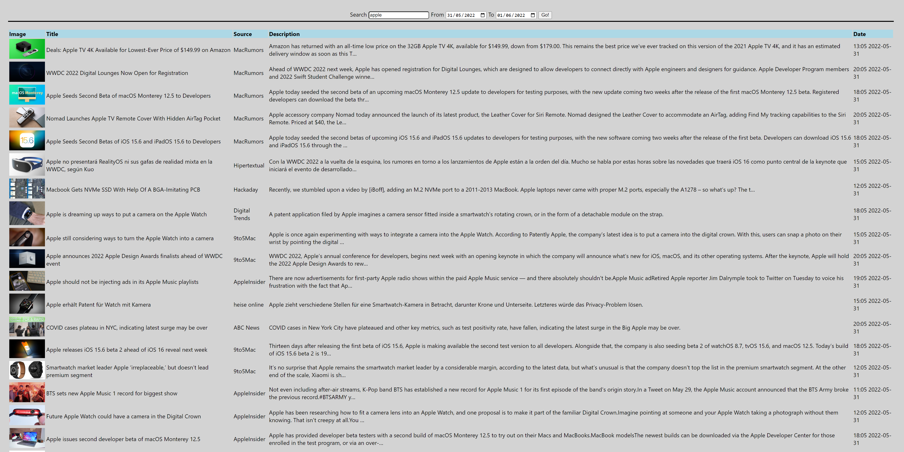

# News reader

## About

A simple news search engine powered by https://newsapi.org/ using react and node.

## How to use

1. Set the environment variable **NewsApiKey**

2. Start both projects in /api and /client using 
   > npm run start

3. Open http://localhost:3000 in a browser

Alternatively the api can also be directly accessed via http://localhost:8080/news  
It accepts 3 query parameters: 
- `query`: **required**; The content to look for in title or body
- `from`: optional; The oldest news articles (inclusive)
- `to`: optional; The newest news articles (inclusive)

example link
http://localhost:8080/news?query=apple&from=2022-05-31&to=2022-05-31

Tested on node v16.12.0 and npm 8.1.0 in chrome

## Development

The api uses [nodemon](https://github.com/remy/nodemon) for building and watching files during development.  
Testing uses [mocha](https://github.com/mochajs/mocha) and can be executed via `npm run test`.   
The server itself is hosted using [express](https://github.com/expressjs/express) and runs on port **8080**.

The client uses [react](https://reactjs.org/) and [date-and-time](https://github.com/knowledgecode/date-and-time) for some date formatting.  
The project runs on port **3000** but also proxies calls to the api.